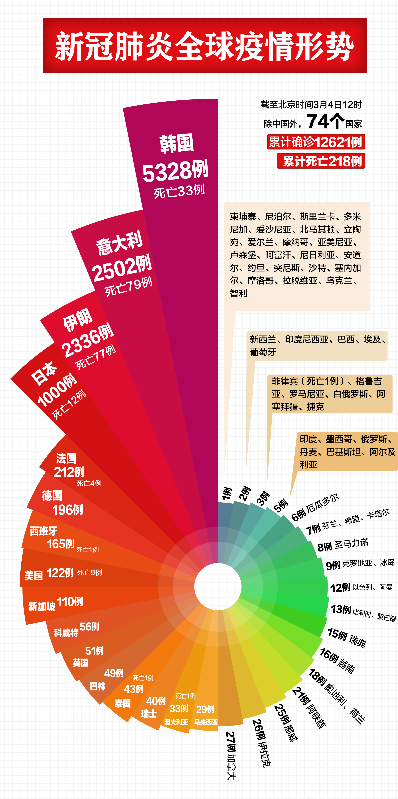

# 仿制人民日报新冠肺炎全球疫情形势南丁格尔玫瑰图

人民日报[微博](https://weibo.com/2803301701/IwTtWr8KZ)、[微信公众号](https://mp.weixin.qq.com/s/LmesmSryK8qJPFce8L-NLw)从2020年3月3日起每日发布`新冠肺炎全球疫情形势图`。  
该图是一张`南丁格尔玫瑰图`，属于饼图的一种，能直观展示各个成员的相对比例关系。  
由于人民日报微博、微信公众号只能下载到小尺寸的图片，本项目利用`Python`和`Photoshop`仿制该疫情图的高清版本。  
最终完成图除了扇区角度和标注位置有微小偏差，其余部分能达到和原图完全重合的效果，相似度极高。

## 运行环境
Python (`numpy`, `pandas`, `matplotlib`), Photoshop

## 制作过程
1. 使用 Python 的`numpy`, `pandas`, `matplotlib`包绘制出南丁格尔玫瑰图主体；
2. 使用 Photoshop 逐层添加文字、设置字体、旋转角度、移动位置。

## 最终完成图
本项目以2020年3月4日的疫情图为素材进行仿制。  
人民日报原图尺寸1080*2168@72dpi  
原文链接：[微博](https://weibo.com/2803301701/Ix2VO4WpH)，[微信公众号](https://mp.weixin.qq.com/s/ZFWx_Ya2CHNWhIe0zOt16A)  

仿制最终完成图尺寸2693*5404px@300dpi  
压缩包内为分层PSD源文件。

